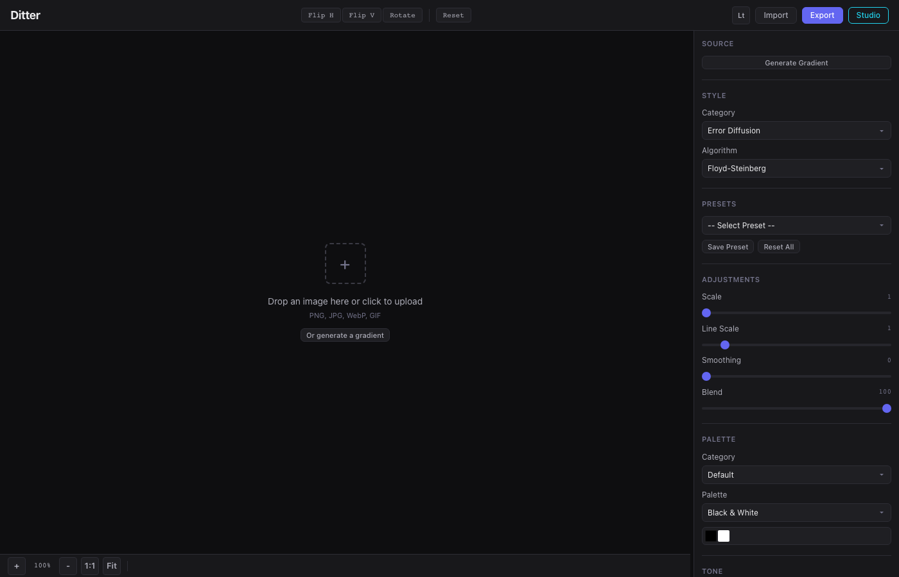

# Ditter

Real-time dithering tool for images and video. 60+ algorithms, GPU-accelerated rendering, and a native desktop app built with Tauri.



## Features

- **60+ dithering algorithms** across 8 categories: error diffusion, ordered, halftone, noise, pattern, artistic, threshold, and creative
- **28 GPU-accelerated algorithms** via WebGL2 fragment shaders, under 5ms even at 4K
- **Video support** with real-time dithering and WebM export
- **16 post-processing effects**: glitch, chromatic aberration, film grain, wave distortion, vignette, scanlines, and more
- **34+ color palettes** including retro (Game Boy, CGA, C64, NES), modern, and themed sets
- **Custom color palettes** with a visual editor and hex/picker input
- **Dither Studio** for building custom threshold patterns with paint, shape, and wave mixing modes
- **SVG vector export** with automatic cell detection and run-length optimization
- **Native desktop app** via Tauri v2 with Save As dialogs and local file access

## Quick Start

### Browser

```bash
npm run dev
# Open http://localhost:8000
```

### Desktop (Tauri)

```bash
cargo tauri dev
```

### Build

```bash
cargo tauri build
```

Produces a signed `.app` and `.dmg` on macOS.

## Tech Stack

- Vanilla JS (no frameworks)
- WebGL2 for GPU shaders
- Web Workers for CPU algorithms
- Tauri v2 for the desktop shell
- IIFE module pattern throughout

## Project Structure

```
index.html          Main app HTML
js/                 Application modules
  app.js            Entry point, wires everything together
  canvas.js         Canvas management, rendering pipeline
  dither-engine.js  CPU dithering algorithms
  webgl-dither.js   GPU (WebGL2) dithering algorithms
  effects.js        Post-processing effects engine
  palettes.js       Color palette definitions
  presets.js        Built-in presets
  ui.js             UI bindings and settings management
  worker.js         Web Worker for CPU algorithms
  studio.js         Dither Studio pattern editor
  video.js          Video processing
  svg-export.js     SVG vector export
css/style.css       All styles
src-tauri/          Tauri desktop app (Rust)
web/                Documentation site
deploy/             Railway deployment (static site)
```

## License

MIT License. See [LICENSE](LICENSE).
